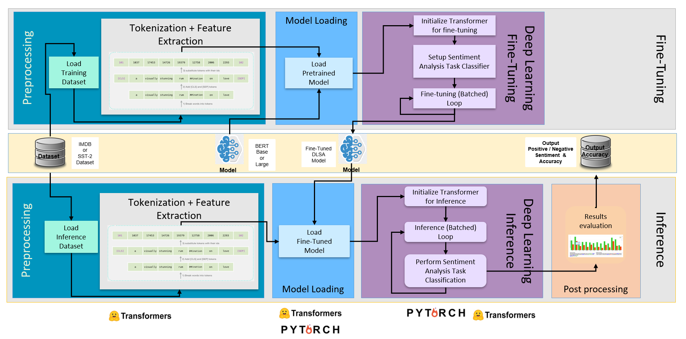

# Overview
The Intel Optimized reference end-to-end pipelines for Document level sentiment analysis (DLSA) using BERT model implemented using Hugging face transformer API.
 

# How it Works
* Uses Hugging face Tokenizer API, Intel PCL Optimization with Hugging Face for Fine-Tuning and Intel Extension for PyTorch for inference optimizations and quantization.

* Classifies the sentiment of any input English paragraph as positive or negative sentiment.

* Uses HF’s BERT model with Masked-Language-Modeling task pretrained using large corpus of English data, to fine tune a new BERT model with sentiment analysis task using SST-2 or IMDB dataset.

* The workflow uses BF16 precision in SPR which speeds up the training time using Intel® AMX, without noticeable loss in accuracy when compared to FP32 precision using (Intel®  AVX-512).
* 
<br><br>

# Get Started

## Docker

### Prerequisites 

### Setup 

### How to run 


## Bare Metal

### Prerequisites 
#### Download the repo
```
git clone https://github.com/intel/document-level-sentiment-analysis.git
git checkout v1.0.0
cd frameworks.ai.end2end-ai-pipelines.dlsa/profiling-transformers
```
#### Download the datasets
```
mkdir datasets
cd datasets
#download and extract SST-2 dataset
wget https://dl.fbaipublicfiles.com/glue/data/SST-2.zip && unzip SST-2.zip && mv SST-2 sst
#download and extract IMDB dataset
wget http://ai.stanford.edu/~amaas/data/sentiment/aclImdb_v1.tar.gz && tar -zxf aclImdb_v1.tar.gz
```
>Note: Make sure the network connections work well for downloading the datasets.
### Setup 
```
conda create -n dlsa python=3.8 --yes
conda activate dlsa
sh install.sh
```
### How to run 
#### Inference Pipeline

| Implementations                                          | Model    | API         | Framework      | Precision      |
| -------------------------------------------------------- | -------- | ----------- | -------------- | -------------- |
| [Run with HF Transformers](inference/hf-transformers.md) | HF Model | Trainer     | PyTorch + IPEX | FP32,BF16      |
| [Run with Stock Pytorch](inference/stock-pytorch.md)     | HF Mode  | Non-trainer | PyTorch        | FP32           |
| [Run with IPEX](inference/ipex.md)                       | HF Mode  | Non-trainer | PyTorch + IPEX | FP32,BF16,INT8 |

#### Fine-Tuning Pipeline


|  Implementations                               | Model    | Instance | API         | Framework       | Precision  |
| ---------------------------------- | -------- | -------- | ----------- | ----------------------- | ---------- |
| [Run with HF Transformers + IPEX ](fine-tuning/single-node-trainer.md)   | HF Model | Single   | Trainer     | PyTorch + IPEX          | FP32, BF16 |
| [Run with Stock Pytorch](fine-tuning/single-node-stock-pytorch.md) | HF Model  | Single   | Non-trainer | PyTorch                 | FP32       |
| [Run with IPEX (Single Instance)](fine-tuning/single-node-ipex.md) | HF Model  | Single   | Non-trainer | PyTorch + IPEX          | FP32,BF16  |
| [Run with IPEX (Multi Instance)](fine-tuning/multi-nodes-ipex.md) | HF Model  | Multiple | Non-trainer | PyTorch + IPEX          | FP32,BF16  |

# Recommended Hardware 
The hardware below is recommended for use with this reference implementation. For other suggestions, see Recommended Hardware.  
# Learn More 

# Known Issues 

# Troubleshooting 

# Support Forum 
If you're unable to resolve your issues, contact the Support Forum. 
